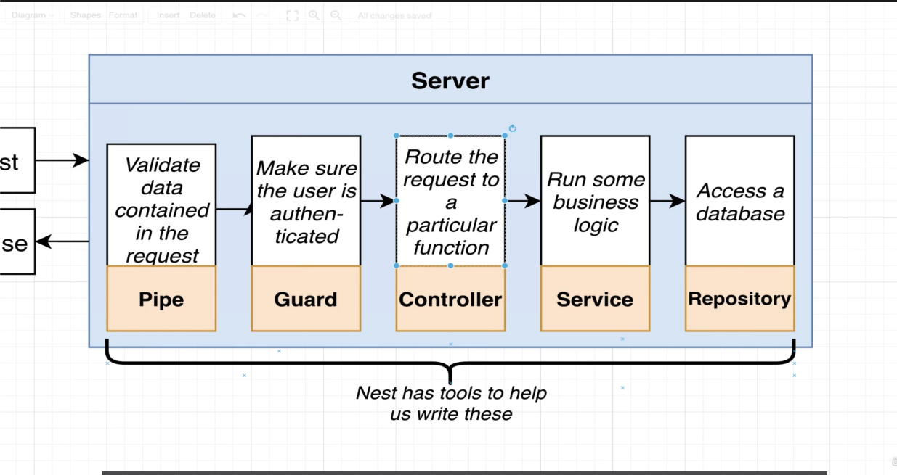
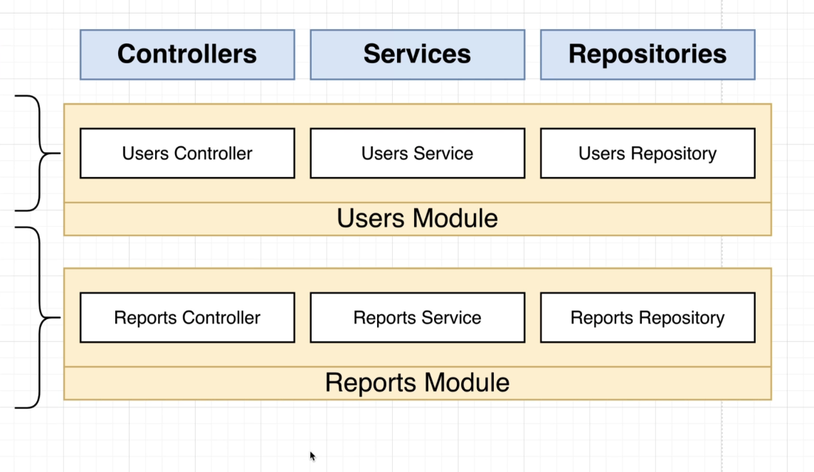

# nest-tut

# http request response cycle

# Modules, { Controller, Services, Repositories }

# Dependency Injection, { Computer -> { { CPU, DISK } -> POWER } }

## Computer Module depends on CPU Services and DISK Services from CPU Module and DISK Module respectively.
## Both { CPU Module and DISK Module } depends on the POWER Services from the Power Module

## Application Planning.

## Persisting Data.

